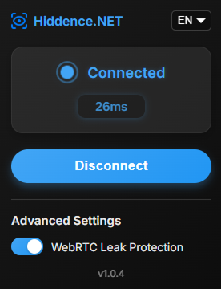

# Hiddence Shield Firefox Extension

**Hiddence Shield** is an open-source Firefox extension that allows users to connect to a proxy server directly from their browser. It provides a simple and intuitive interface to toggle the VPN connection, enhancing privacy and accessibility while browsing the web.



## Features

- **One-Click Connection**: Easily connect or disconnect from the proxy server with a single button.
- **Status Indicator**: Visual feedback on your connection status with animated icons.
- **Multi-language Support**: Interface available in 13 languages: English, Russian, Spanish, German, Ukrainian, Portuguese, Italian, French, Dutch, Swedish, Arabic, Japanese, and Chinese.
- **WebRTC Protection**: Built-in protection against WebRTC leaks to maintain your privacy.
- **Real-time Ping Measurement**: Monitor connection quality with live ping updates.
- **Lightweight**: Minimal impact on browser performance.
- **Open-Source**: Transparent codebase for community collaboration and improvement.

## Table of Contents

- [Installation](#installation)
- [Usage](#usage)
- [Configuration](#configuration)
- [Language Support](#language-support)
- [Security Considerations](#security-considerations)
- [License](#license)
- [Acknowledgments](#acknowledgments)
- [Disclaimer](#disclaimer)

## Installation

### Clone or Download the Repository

```bash
git clone https://github.com/Hiddence/HiddenceShield-extension.git
```

### Install as a Temporary Add-on in Firefox

1. Navigate to `about:debugging` in your Firefox browser.
2. Click on "This Firefox" in the left sidebar.
3. Click on "Load Temporary Add-on".
4. Browse to the location where you cloned or downloaded the repository and select the `manifest.json` file.

### Alternative: Install from Firefox Add-ons

1. Visit [Firefox Add-ons](https://addons.mozilla.org/) and search for "Hiddence Shield".
2. Click "Add to Firefox" to install the extension.
3. Follow the prompts to complete the installation.

### Verify Installation

- The extension should now appear in your list of installed add-ons.
- You can pin it to your toolbar for easy access by right-clicking on the icon and selecting "Pin to Toolbar".

## Usage

1. **Open the Extension**: Click on the Hiddence Shield icon in your Firefox toolbar.
2. **Select Your Language**: Choose your preferred language from the dropdown menu in the top-right corner.
3. **Connect to the Proxy**: Click the Connect button to establish a connection to the proxy server. The status indicator will change to show that you are connected.
4. **Disconnect from the Proxy**: Click the Disconnect button to terminate the connection. The status indicator will revert to show that you are not connected.
5. **WebRTC Leak Protection**: Use the WebRTC Leak Protection slider to block WebRTC. The slider is automatically set to "enabled" by default, but you can disable it if needed.
6. **Monitor Connection Quality**: When connected, the extension will display the current ping to the proxy server, updating in real-time when the extension window is active.

## Configuration

Before using the extension, you need to configure it to work with your proxy server:

### Proxy Settings

Open the `js/background.js` file located in the extension's directory and locate the proxy configuration section:

```javascript
const PROXY_HOST = 'proxy.example.com';
const PROXY_PORT = 1080;
const PROXY_SCHEME = 'socks5';

const servers = {
    auto: { 
        host: PROXY_HOST, 
        port: PROXY_PORT,
        scheme: PROXY_SCHEME
    }
};
```

Replace the proxy configuration with your own settings. Modify `host`, `port`, and other values as needed for your proxy server.

## Language Support

The extension supports the following languages:

- 🇺🇸 English (EN)
- 🇷🇺 Russian (RU)
- 🇪🇸 Spanish (ES)
- 🇩🇪 German (DE)
- 🇺🇦 Ukrainian (UK)
- 🇵🇹 Portuguese (PT)
- 🇮🇹 Italian (IT)
- 🇫🇷 French (FR)
- 🇳🇱 Dutch (NL)
- 🇸🇪 Swedish (SV)
- 🇦🇪 Arabic (AR)
- 🇯🇵 Japanese (JA)
- 🇨🇳 Chinese Simplified (ZH)

The extension will automatically try to detect your browser's language and use it if available. You can also manually select any language from the dropdown menu.

To add more languages, simply extend the `translations` object in the `js/translations.js` file.

## Security Considerations

### Avoid Hardcoding Credentials

Hardcoding sensitive information like usernames and passwords directly into the code poses significant security risks:

- **Exposure of Credentials**: If the code is shared or published, your credentials can be accessed by anyone.
- **Unauthorized Access**: Malicious users could use your credentials to access the proxy server or other services.

#### Recommended Solutions:

- **Prompt for Credentials**: Modify the extension to prompt you for your credentials when connecting. Store them securely using `browser.storage.local` with appropriate encryption.

- **External Configuration File**: Store credentials in a separate, non-tracked configuration file. Ensure this file is listed in `.gitignore` to prevent it from being committed to version control.

### Secure Proxy Certificate

If your proxy server uses a self-signed SSL certificate, you may encounter certificate errors in Firefox. To resolve this:

- **Use a Trusted Certificate Authority (CA) Certificate**: Obtain an SSL certificate from a trusted CA for your proxy server domain. This ensures Firefox will trust the proxy's SSL certificate without additional configuration.

- **Manually Trust the Certificate**: Import the proxy's CA certificate into your system's trusted certificate store or Firefox's certificate store.
  - Note: This approach may not be suitable for all users and can pose security risks if not handled properly.

## License

This project is licensed under the MIT License. You are free to use, modify, and distribute this software, but please provide attribution to the original author.

## Acknowledgments

- **Icons and Fonts**: Icons used in this project are sourced from Font Awesome under the Creative Commons Attribution 4.0 International license. Fonts are provided by Google Fonts.

## Inspiration

This project was inspired by the need for a simple and effective way to manage proxy connections directly within the Firefox browser.

## Disclaimer

Usage of this extension is at your own risk. The author is not responsible for any misuse or damage caused by this extension. Ensure you comply with all applicable laws and terms of service when using proxy servers and VPNs. 